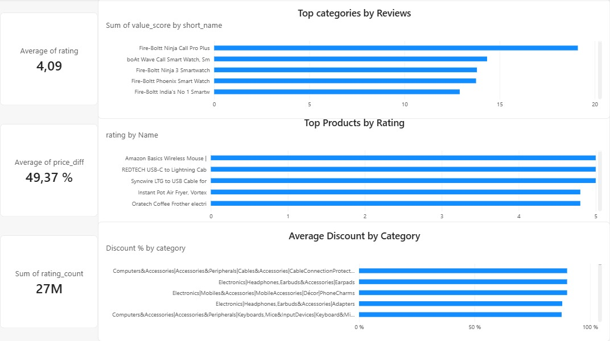

# Amazon Sales Analysis

## Overview
This project focuses on analyzing Amazon product sales, ratings, discounts, and customer reviews using Python, SQL (SQLiteOnline), and Power BI.

The goal was to clean raw data, perform exploratory data analysis, write SQL queries, and build an interactive dashboard for business insights.

---

## Tools & Technologies
- Python
- Pandas
- NumPy
- SQL (SQLiteOnline)
- Power BI
- Jupyter Notebook

---

## Project Workflow
1. Data cleaning and preprocessing in Jupyter Notebook
2. SQL analysis using SQL (SQLiteOnline)
3. Dashboard creation in Power BI
4. Business insights and visualization

---

## Key Insights
- Electronics products received the highest number of reviews
- Average product discount is around 49%
- Highly rated products tend to have stronger customer engagement
- Some categories combine high discounts with high ratings

---

## Files Included
- `amazon_analysis.ipynb` → Python analysis
- `sql_queries.sql` → SQL queries
- `dashboard.pbix` → Power BI dashboard
- `dashboard.png` → Dashboard screenshot

---

## Dashboard Preview

---

## Author
Danial Zholdasbai
